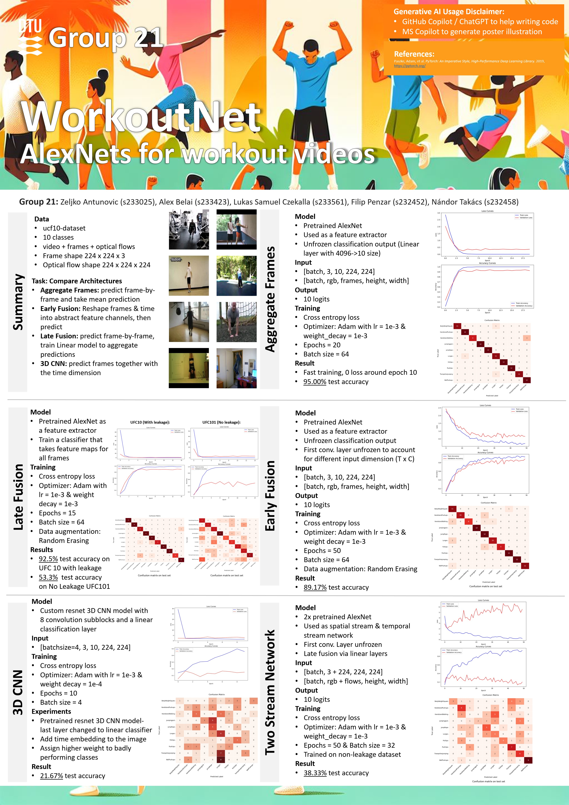
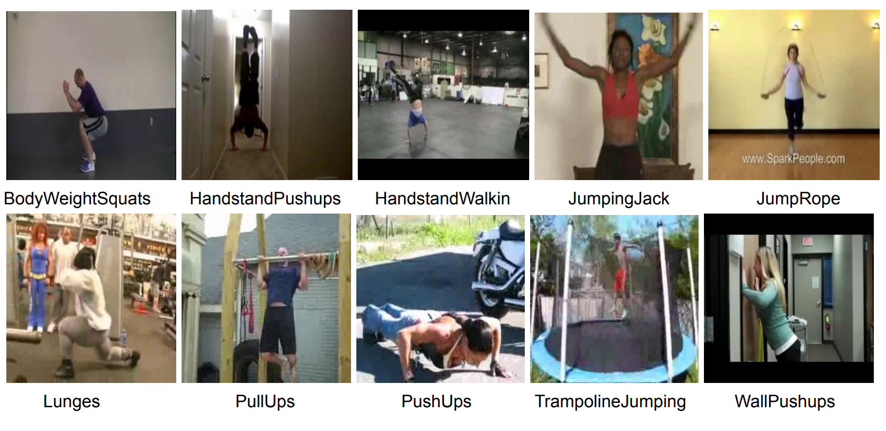

# 02516_IDLCV_Project_04

## Project Description

This project aims to classify workout videos according to their actions. The main part of the project is a comparison of different architectures:

- **Aggregate Frames**: predict frame-by-frame and take mean prediction​
- **Early Fusion**: Reshape frames & time into abstract feature channels, then predict​
- **Late Fusion**: predict frame-by-frame, train Linear model to aggregate predictions​
- **3D CNN**: predict frames together with the time dimension



## Data

A subset of the [ucf-101 dataset](https://www.crcv.ucf.edu/data/UCF101.php) for video action recognition derived from this [Kaggle competition](https://www.kaggle.com/datasets/matthewjansen/ucf101-action-recognition).

The provided dataset includes 720 videos (500/120/120 for train/val/test) of 10 balanced classes related to workout, mode precisely including the classes ['BodyWeightSquats', 'HandstandPushups', 'HandstandWalking', 'JumpingJack', 'JumpRope', 'Lunges', 'PullUps', 'PushUps', 'TrampolineJumping', 'WallPushups'].



## Run training on the HPC

To start training using batch jobs first modify the jobscript.sh file you want to use. Please note that every contributor is recommended to create his own jobscript_[NAME].sh file according to his preferences.

Then execute:

```bash
bsub -app c02516_1g.10gb < jobscript_[NAME].sh
```

To monitor the progress execute:
```bash
bstat
```

To abort the run:

```bash
bkill <job-id>
```
## Submission Deadline

Submission on Tuesday 03.12.2024 at 22:00.
